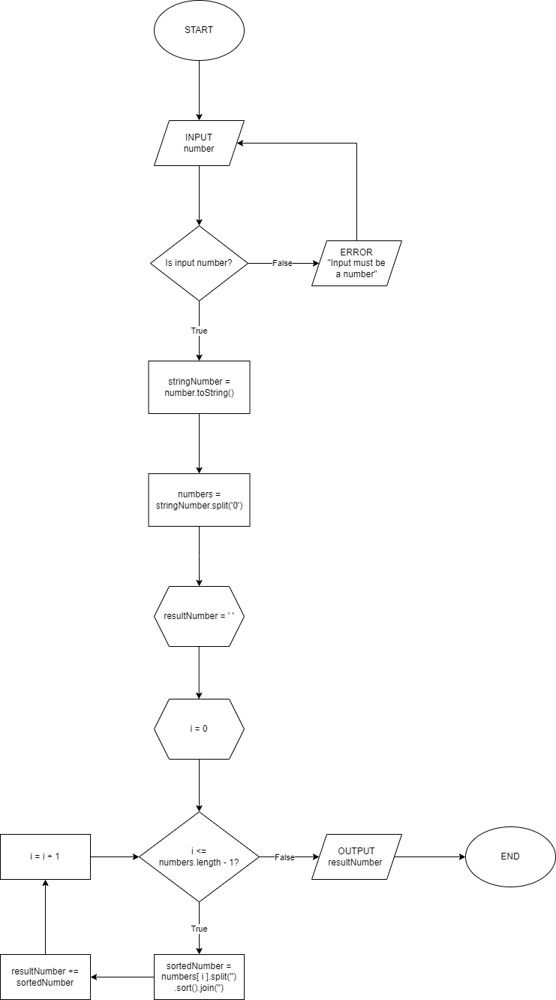

<h2>
1. Palindrome Check
</h2>

```bash
# Call the function
palindromeCheck('Katak')
```

```bash
# The result
Palindrome
```

<h2>
2. Reverse Words
</h2>

```bash
# Call the function
reverseWords('Saya Belajar Javascript')
```

```bash
# The result
Javascript Belajar Saya
```

<h2>
3. Fazzfood
</h2>

<p align="center"></p>

```bash
# Call the function
fazzFood(120000, 'FAZZFOOD50', 10, true)
```

```bash
# The result
Price: 120000
Discount: 50000
Delivery Fee: 29000
Tax: 6000
Sub-Total: 105000
```

<h2>
4. Divide and Sort
</h2>

<p align="center"></p>

```bash
# Call the function
divideAndSort(2980878096087544)
```

```bash
# The result
2897886944578
```
